# Creating a Consistent Character as a Textual Inversion Embedding with Stable Diffusion

One of the great things about generating images with Stable Diffusion ("SD") is the sheer variety and flexibility of images it can output. However, some times it can be useful to get a _consistent_ output, where multiple images contain the "same person" in a variety of permutations.

To that end, I've spent some time working on a technique for training Stable Diffusion to generate consistent made-up characters whose faces, bodies, and hair look essentially the same whenever you use them in a prompt. This tutorial is a description of the approach I use.

## LastName characters

You can see [all of the "LastName" characters I've trained with this method on CivitAI](https://civitai.com/user/BelieveDiffusion). And credit where it's due - they were inspired by the [Nobody series by Zovya](https://civitai.com/tag/znobody). Thank you for the inspiration, Zovya!

## Goals

If all goes to plan, by the end of this tutorial you will have created a Stable Diffusion [Textual Inversion embedding](https://arxiv.org/abs/2208.01618) that can reliably recreate a consistent character across multiple poses, SD checkpoints, hair styles, body types, and prompts.

## Process

The creation process is split into five steps:

1. Generating input images
2. Filtering input images
3. Tagging input images
4. Training an embedding on the input images
5. Choosing and validating a particular iteration of the trained embedding

# 1. Generating input images

Training an AI is a classic example of "[garbage in, garbage out](https://en.wikipedia.org/wiki/Garbage_in,_garbage_out)". The better the input images you provide, the better the output you'll get. To that end, I use SD to generate the input images for the character I'm going to train. That way, I can generate hundreds of permutations based on a description of that character, and pick just the best images to use for the later training.

I generate these images via [Automatic1111's Stable Diffusion web UI](https://github.com/AUTOMATIC1111/stable-diffusion-webui) (I'll call it "A1111" below). I won't cover how to set up A1111 here; there are lots of tutorials available for getting A1111 up and running. But here's how I customize A1111 for input image generation.

## Choosing a checkpoint for generating your input images

You can use any SD checkpoint you like to generate your input images, although it's essential that the model you choose has seen (and can generate) representative examples like your character. I've been creating photorealistic made-up characters, and I've found [Deliberate](https://civitai.com/models/4823/deliberate) (v2) to be a good, flexible checkpoint for that, but there are plenty of other models available on sites like [CivitAI](https://civitai.com/).

## Turning on the inclusion of tags in the output filenames

We're going to define an input prompt for generating our input images, which we'll convert into a training prompt later on. To make that conversion process as easy as possible later, set the "Images filename pattern" in A1111's "Settings > Saving images/grids" settings to `[seed]-[prompt_spaces]`, and then click "Apply settings". This will include the seed and generation prompt in the filename of every generated PNG image we create below.

## Setting up an input prompt

With your preferred generation checkpoint selected in A1111's web interface, open the `txt2img` tab, and enter a positive prompt with the following format:

```
an extreme closeup front shot photo of %your character's look% (naked:1.3), %your character's body shape%, %your character's hairstyle%, (neutral gray background:1.3), neutral face expression
```

For this input prompt, I've boosted the strength of the `naked` prompt token, to say "we _really_ want the images to be of the character naked, please." I've found this reduces the number of non-naked images we have to throw away later on. Similarly, I've boosted "neutral gray background", so that (hopefully) all of the images come out with nothing distracting in the background.

Replace `%your character's look%`, `%your character's body shape%`, and `%your character's hairstyle%` in the prompt with descriptions that will reliably generate a face, body, and hairstyle that match your target character.

Be descriptive, but try to stay within the `75/75` limit of A1111's input prompt box. The fewer essential details you provide, the more chance there is that those details will be present in every image you generate. (And the facial details are the ones that really matter.)

One tip I've learned from experience: adding a country of origin can really help to hone in on an overall base look, which you can then refine with more details. (A country of origin may also guide your character's overall skin tone, too.)

Here's an example of just-enough-but-not-too-much detail:

```
an extreme closeup front shot photo of a beautiful 25yo French woman with defined cheekbones, a straight nose, full lips, hazel eyes, chin dimple, square jaw, plucked eyebrows, (naked:1.3), small breasts, toned body, chin length straight black hair in a bob cut with bangs, (neutral gray background:1.3), neutral face expression
```

For the negative prompt, try something like this:

```
(gray hair:1.3), (glasses:1.2), (earrings:1.2), (necklace:1.2), (high heels:1.2), young, loli, teen, child, (deformed, distorted, disfigured:1.3), poorly drawn, bad anatomy, wrong anatomy, extra limb, missing limb, floating limbs, (mutated hands and fingers:1.4), disconnected limbs, mutation, mutated, ugly, disgusting, blurry, amputation, tattoo
```

Note that I've added `(gray hair:1.3)` to the negative prompt there. Boosting `neutral gray background` in the positive prompt has a tendency to cast a gray color over anything else with a specified colored in the prompt, so we need to counterbalance that for the black-colored hair to make sure we get the color we want. (This is a good trick whenever two colors in a prompt start to influence each other in a way you don't want.)

Next, set the following `txt2img` settings in A1111:

- Sampling method: DPM++ 2M Karras
- Sampling steps: 30
- Restore Faces: On
- Tiling: Off
- Hires. fix: Off
- Width: 512
- Height: 512
- CFG Scale: 7
- Seed: -1

These settings should give good-quality outputs, at the expense of slightly longer generation times. (But remember: garbage in, garbage out.)

### Why naked and neutral?

I like to make input images that are as "neutral" as possible, so that SD learns the essence of them without also learning things that we might want to change for variety in image generation prompts. So, I try to avoid generating images that contain things like glasses, earrings, necklaces, and so on, that might bias later generation to include those same items.

I also choose to generate the training input images without clothes, because I want to train the base concept of a hypothetical human that I can then add any clothing or accessories to via custom prompts later on. SD has seen a lot of humans wearing a lot of different clothes, but it has never seen your custom character naked, so that's what we'll give it as input, for the most flexibility.

I also use a neutral gray background in all my input images, to keep the training focused on the character on the foreground. (We'll tell SD that we used a neutral gray background later on, so that it doesn't learn "neutral gray background" as part of the character's attributes.)

## Testing the input prompt

With the settings above in place, generate a small set of test images to see how well your prompt performs. I usually set `Batch count` to 2 and `Batch size` to 4 (with a `Seed` of `-1`), then hit Generate, to create eight test images. This helps me to see if the prompt creates a consistent (enough) output across multiple seeds.

Note that even with a detailed description like the one above, your character might not (yet) look entirely consistent between all of the images. That's okay - we will improve that by filtering the images later, and also by averaging the character's visual characteristics through training. But you still want to be seeing a recognizable-enough consistency at this stage. If you don't, tweak your prompt, and try again.

## Generating permutations

The next thing we want to do is to generate a whole bunch of variations of our character, with different viewing angles and camera zooms. I mentioned above that SD follows the principle of "garbage in, garbage out"; the same also holds for "variation in, variation out". In other words, the more of a variety of angles and framings we can show SD of our character, the better SD will become at generating varied angles and framings when we use our character in prompts later on.

To add this variety, open the `Script` menu, and select `X/Y/Z Plot`. Set `X type` and `Y type` to `Prompt S/R` ("Prompt search and replace"), and keep `Z type` as `Nothing`.

In the `X values` text box, paste the following five zoom levels:

```
an extreme closeup, a medium closeup, a closeup, a medium shot, a full body
```

This tells the A1111 web UI that we want to generate images with five different permutations of our prompt - one that uses the original `an extreme closeup` text from the main prompt box, and four others that replace that text in the prompt with an alternative zoom level. This will give us images of our character from a variety of distances.

In the `Y values` text box, paste the following five viewing angles:

```
front shot, rear angle, side angle, shot from above, low angle shot
```

This tells the A1111 web UI that we want to generate images with five more permutations of our prompt - one that uses the original `front shot` viewing angle, and four others that replace that text with an alternative angle for viewing the character.

Because we have _two_ `Prompt S/R` options set for the script, with five variations in each, we've actually told A1111 to generate 25 permutations of our prompt - one for each combination of framing and viewing angle. This will give us lots of varieties of views of our character to choose from for training.

(Note: I borrowed these zoom levels and viewing angles from the [Unstable Diffusion tagging white paper](https://docs.google.com/document/d/1-DDIHVbsYfynTp_rsKLu4b2tSQgxtO5F6pNsNla12k0/edit).)

Finally, check the box next to `Keep -1 for seeds`, and set `Batch Count` and `Batch Size` both to 4. This will generate 16 images for every permutation of the above, in batches of four for speed. (If your GPU can handle it, you can use a `Batch Count` of 2 and a `Batch Size` of 8 instead.)

Here's how that looks for me with today's A1111 interface:

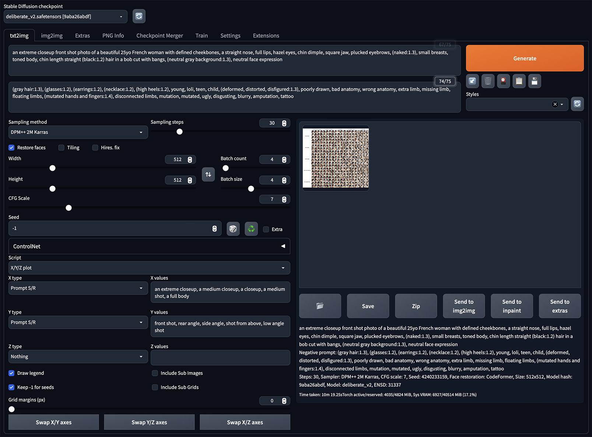

With all of the above, we have asked A1111 to generate 400 images (16 x 5 x 5). Hit the `Generate` button, and leave A1111 to do its thing. Maybe make a hot beverage. Step 1 is complete!

# 2. Filtering input images

You now have 400 _possibly_ good images that _possibly_ look like the character you're trying to create. The next step is to filter these 400 images down to 25 or so _definitely_ good images to train with. Here's how I do that.

## Remove any images that are obviously off-prompt

Here, I'd remove images where the character is clothed, or wearing jewelry, or has a non-matching hairstyle, or has their face off-screen, or the background isn't gray, or the arms / legs are funky, or there are multiple people, or… basically, anything that isn't what we asked for.

Here's an example of some of the images I removed from my set of 400 at this step in the process. Note that I removed any images where the hairstyle did not have the requested bangs (fringe), to ensure consistency in the training images later on. This first pass removed 45 images. (Check the image alt tags for the reasons why I removed them.)

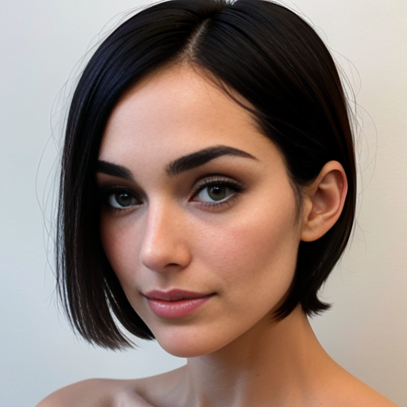
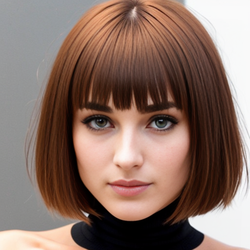

## Remove poor quality images

This time, we're removing images that have wonky faces, or weird-looking nipples, or eyes that Restore Faces kinda messed up, or… images are just not a great photo of a person.

Here's an example of an image I removed at this stage (66 in total).

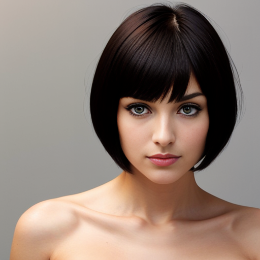

## Remove images that don't "look like the character"

This might seem like a weird thing to say. This person doesn't exist! How do we know what they look like?

Well: that's for you to define. There will usually be an overall "look" to the character already by this point, and some of the images won't match that look nearly as well as the others. So, filter those images out, and narrow in on the look of the specific person you're trying to create.

For reference, I cut another 119 images in this step. This was partly because I decided to enforce a slightly more consistent hair length for the bob haircut, and partly because I used this stage to really hone in on the look of the character. Here are some examples of the images I cut. (And I should stress that this is _not_ an exact science.)
	
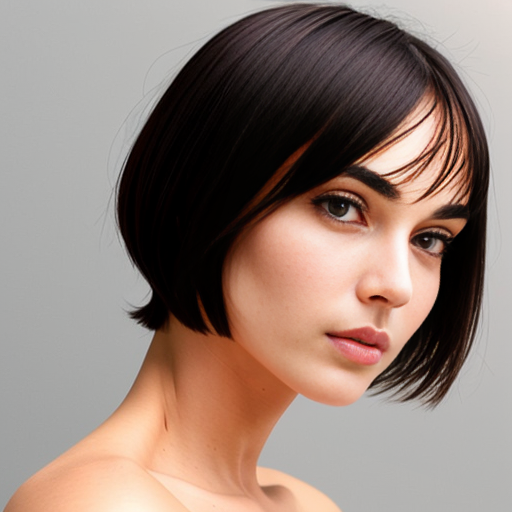
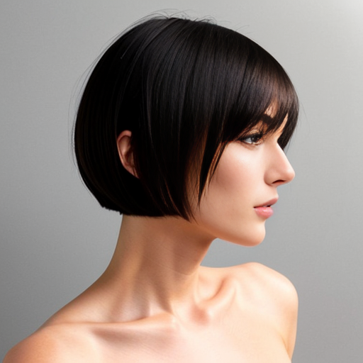
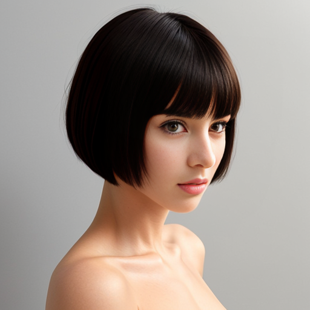

## Fine-tune to just the best images

This is really just a much more selective take on the second and third steps above, to narrow in to the best of the best images in the input set. I culled a ton of okay-but-not-really-adding-anything images at this step to get me to my final 25.

Ideally, after doing all of the above, you will have 25 good-quality images left that look like the character you're aiming for. Even more ideally, the final set of images will contain a good representation of the five zoom levels and viewing angles too.

# 3. Tagging input images

In theory, you can just pass all of your input images to the trainer without any tags, and get a textual inversion embedding out the other side. However, a little bit of tweaking and simplifying of the training tags will go a long way to improving the output.

## Naming your character

The first and most important thing to include in the tagging is the name of the character (and embedding) itself, i.e. the new thing we want SD to learn. Now is a good time to choose a name for your embedding.

You're looking for a single word (more precisely, a _token_) to name the embedding. This token should be a series of letters and numbers without spaces, which is very unlikely to have shown up on the Internet in the images that SD was trained on. As an example, for my [Antonia LastName character](https://civitai.com/models/19725/antonia-lastname), I chose `antonialastnamesd15`. But the embedding name can be anything, as long as it's not a token that already has a meaning.

If you're not sure your choice of embedding name / token is unique enough, just try sticking it in a `txt2img` prompt all by itself, and generating a few images with the base SD1.5 checkpoint to see what SD thinks that token already means.

For the purposes of this tutorial, let's call our character `fr3nchl4dysd15`.

## Removing the character description

For training, we can remove nearly all of the detail from the generation prompt in order to make a training prompt. Specifically, we can remove the following:

- the character's look
- the character's body shape
- the character's hairstyle

…because we want SD to learn that all of those things combined are known as `fr3nchl4dysd15`. Essentially, the thing we want SD to learn - our character - is the sum total of all of those attributes combined. It's kind of like saying we have "a photo of Marilyn Monroe", but instead of using the name "Marilyn Monroe", we're using the made-up name "`fr3nchl4dysd15`".

I should note that training the body shape and hairstyle as part of the character does remove a _little_ bit of the flexibility from the embedding, but I've found that in practice I can still change the body style and hairstyle after the event pretty easily with a more detailed prompt. Including the body shape and hairstyle in the essence of the character makes it much easier and quicker to generate consistent outputs without spending future prompt tokens on the things we want to become part of our character's default style.

## Tidying up the input prompts

One of the goals of tagging is to tell the training process about all of the things that are _not_ the essence of your character in each image. For example: we generated training images above that had a neutral gray background, but we don't always want our character to appear in images with neutral gray backgrounds. So, we want to keep the "neutral gray background" tag when each image is used for training, so that the trainer knows that "neutral gray background" is not an attribute of our character.

We likewise don't want the character to always be naked, so we'll keep "naked" in our training prompt too. (We don't need to boost these two terms in the training prompt - we're just stating facts about the generated images).

> Note: You don't *have* to tell the training that your input images were naked… but if you don't, then images you generate with the embedding are much more likely to be naked by default. That's not a goal of my own training, so I choose to leave `naked` in the training tags.

We will, however, remove the original viewing angles from the generation prompt, because they're not something we really need SD to learn - they were more to ensure we got a varied set of input images from step 1 above.

We will likewise remove `neutral face expression` from the training prompt, because we don't need to train SD on this fact - the absence of a facial expression is implicit from its omission from the training prompt. (We only specified it in the generation prompt in step 1 to ensure we got neutral expressions to train on.)

The one other thing I do keep around in the training prompt is the zoom levels. I don't want SD to learn that `fr3nchl4dysd15` is always in `a closeup photo` (or whatever zoom we ended up with most of). We don't want the embedding to learn a particular zoom level, so we keep it in the training prompt.

There is one problem with that - we may have _asked_ SD to generate `an extreme closeup photo` for some image in our initial set of 400 images, but that's no guarantee that SD actually gave us what we asked for. So, we need to go through each filtered image, and check that the zoom level actually matches the image.

## Tidying up the zooms

In many cases, the requested zoom level from a prompt in step 1 will match the image we got back. But that's not always the case - I often find that I don't get any `extreme closeup` images from step 1 above, for example.

The way I approach this tidy-up process is to create (up to) five folders, named after each of the requested zooms, and to copy images into those folders based on the zoom level in their original filename. (This is why we included the generation prompt in the PNG file name above.) I then look through the images in each folder, and move any that don't fit the description of that zoom level to a more appropriate folder.

There's no exact science to what these zoom definitions mean. Here's how I apply the zooms, working from widest angle to closest:

1. Can you see the knees? If so, it's probably `"a full body"` photo.
2. Can you see the waist? If so, it's probably `"a medium shot"` photo.
3. Can you see the breast area? If so, it's probably `"a closeup"` photo.
4. Can you see the neck area? If so, it's probably `"a medium closeup"` photo.
5. If none of the above, it's probably `"an extreme closeup"` photo.

Don't worry too much if you don't have any `extreme closeup` photos, or if your `full body` folder has few or no images in it once you're done. The important thing is that the zoom definitions you do have are correct.

## Renaming the tidied images

With our (up to) five folders of images now correctly organized, the last step of tagging is to rename those images to provide an essential training prompt (plus a number, to make the filenames unique). How you perform this renaming is up to you; I'm on a Mac, so I use the built-in Automator app.

Rename all of the images in each folder to have names like this:

```
a closeup photo of fr3nchl4dysd15 naked, neutral gray background (1).png
a closeup photo of fr3nchl4dysd15 naked, neutral gray background (2).png
…
a full body photo of fr3nchl4dysd15 naked, neutral gray background (1).png
a full body photo of fr3nchl4dysd15 naked, neutral gray background (2).png
…
a medium closeup photo of fr3nchl4dysd15 naked, neutral gray background (1).png
a medium closeup photo of fr3nchl4dysd15 naked, neutral gray background (2).png
…
```

…and so on. Finally, copy all 25 of the renamed images into a single folder that A1111 can access.

The names of these renamed images will be used in our training prompt during training, giving training prompts like this:

```
fr3nchl4dysd15, a closeup photo of fr3nchl4dysd15 naked, neutral gray background (1)
```

Don't worry about the number in brackets at the end - SD will ignore it.

# 4. Training an embedding on the input images

With the input images generated and tagged, it's time to train the embedding.

The first (and easiest to forget) step is to switch A1111's `Stable Diffusion checkpoint` dropdown to reference one of the [base Stable Diffusion 1.5 checkpoints](https://huggingface.co/runwayml/stable-diffusion-v1-5). You always want to train an embedding against the base 1.5 checkpoint, so that it is as flexible as possible when applied to any other checkpoint that derives from the SD 1.5 base (which almost all of the popular checkpoints used with Stable Diffusion do). I use the smaller `v1-5-pruned-emaonly.ckpt` (4.27GB), but you can use the larger `v1-5-pruned.ckpt` (7.7GB) if you have it - either will work just fine for training a Textual Inversion.

## Creating a new Embedding

Head over to the `Train` tab in A1111, and select the `Create embedding` sub-tab. Enter the name of your embedding / character (`fr3nchl4dysd15` in our case) in the `Name` box. This primarily defines the name of the output embedding file on disk, but that filename also defines what you will use in your prompts to generate images with your embedding. (If ever you want to change the token that you use in prompts, just rename the embedding on disk.)

When you create the embedding in the A1111 web interface, you also have the option to provide some `Initialization text`. By default this is `*` (an asterisk), which is a wildcard that does not provide any specific starting point for the training. I always change this to `woman`. My understanding is that this sets the starting point of your custom embedding's training to be everything that SD has already learned about the word `woman` from looking at millions of images from the Internet. In other words, it doesn't need to learn the woman-ness of the subject in the images; it just needs to learn the specific person-ness of your female character.

Next up is the `Number of vectors per token` count. I always set this to `8`, which seems to work well for the number of input images I use. As I understand it, this is kind of the "capacity" of the embedding to store learned details of your character. Too low a vector count, and the embedding struggles to capture the essence of the character; too high a count, and it learns too much. (The count also seems to be related to, or at least sensitive to, the number of input images.)

It's also important not to set the number of vectors per token _too_ high, because this number eats into the total number of vectors that can be used in a prompt before reaching the SD limit of 75. I figure that 8 vectors for the character leaves 67 for the prompt, so it's not too bad.

Finally, I always check the `Overwrite Old Embedding` checkbox, so that if I mess things up with the training, and need to recreate an empty embedding to start over, I won't need to remember to check the box each time.

With all of that set, click `Create embedding` to write a new, empty embedding `fr3nchl4dysd15.pt` inside the `/embeddings` folder of your A1111 installation, ready for training.

Here's how all of those settings look in A1111:

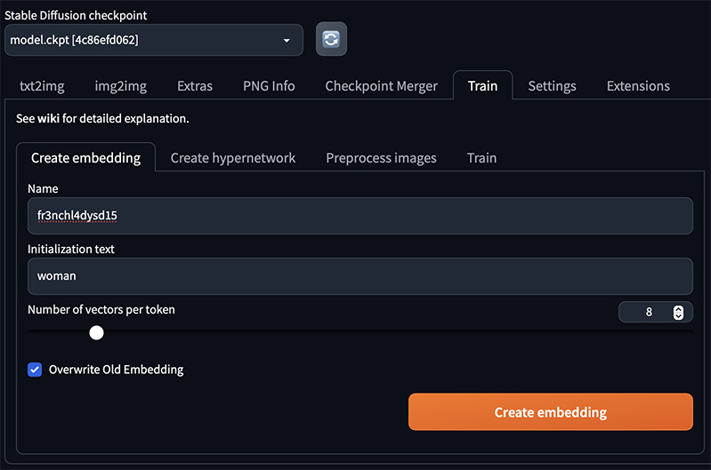

## Training the embedding

Next, head over to the `Train` sub-tab. I'll cover all of the training settings below, but if you just want a summary, here's how my settings look in A1111:

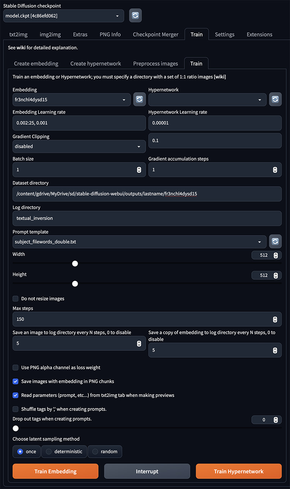

### Basic settings

Select the embedding you just created (`fr3nchl4dysd15`) in the `Embedding` drop-down.

You can ignore the `Hypernetwork` dropdown and the `Hypernetwork Learning rate` field - those are only used when training a Hypernetwork, which we're not doing here.

For 25 input images, I set `Embedded Learning rate` to `0.002`. This tells SD to train with a fixed, balanced rate of `0.002`.

> Note: Previously I recommended a varied training rate, starting with a higher value such as `0.005`, and then lowering the rate after a certain number of steps. However, I've found that even with the exact same settings and images, multiple training runs can "turn" at a different point, due to the inherent randomness of the training process. This makes it hard to know when to change from one rate to the next, because the right step at which to change the rate will vary from run to run. I've found I get perfectly good results with a fixed learning rate.

I leave `Gradient Clipping` as `disabled`, and leave the value as `1`.

### Batch size and gradient accumulation steps

Next up is `Batch size` and `Gradient accumulation steps`. These two settings (multiplied together) define how many images the trainer looks at before updating its understanding of what `fr3nchl4dysd15` means. I've seen quite a few tutorials that recommend setting these values higher than the defaults of `1` and `1`. If you do, `Batch size` will define how many images are loaded onto your GPU at once for learning, and `Gradient accumulation steps` will define how many of those batches are viewed by the trainer before updating its understanding of the concept it is learning. However, every time I tried using different (higher) values in these settings, I found that the output embedding did not generate images that matched the input images as closely as I would like (indeed, the higher the numbers, the more the variance). So I always use the default values of `1` and `1`.

`Dataset directory` should be set to the path on disk (accessible to A1111) where the input images and tagging text files are stored. This can be whatever you like.

I usually leave `Log directory` at the default value.

### Prompt template

`Prompt template` is really important to change. If you leave it at the default of `style_filewords.txt`, SD will learn the _style_ of your input images, not the subject (i.e. the character) they contain. The prompt template tells SD how to make the input training prompt for each image in your `Dataset directory`, and so it's important to get it right.

I've actually made my own prompt template, which goes in the `textual_inversion_templates` folder of your A1111 installation. I call it `subject_filewords_double.txt`, and it contains just the following text:

```
[name], [filewords]
```

This file gets translated by SD into a training prompt for each input image. `[name]` is translated into the name of the embedding (`fr3nchl4dysd15`), and `[filewords]` is translated into the tags from the filename for that image. So, for one of our images, the combined training prompt from this text file might be:

```
fr3nchl4dysd15, an extreme closeup photo of fr3nchl4dysd15 naked, neutral gray background
```

You might notice that this includes the text `fr3nchl4dysd15` twice, and you would be correct. I tried using just `[filewords]` as the contents of the template, but that triggers a bug in A1111 that causes training to fail. And so, I use `[name], [filewords]` instead. I'm not _entirely_ sure what the impact of having the embedding token in there twice is, but I do know that it's working well for me, so I'm sticking with it.

### Image size

Leave the `Width` and `Height` at their default values of `512`. There's no need to check the `Do not resize images` checkbox, because they don't need resizing anyway.

### Steps

With all of the settings above, and an image dataset of 25 images, I find that the model tends to become well-trained somewhere between 100-120 training steps. To that end, I normally set `Max steps` to `150`.

For `Save an image to log directory every N steps, 0 to disable` and `Save a copy of embedding to log directory every N steps, 0 to disable`, I usually set these to `Save an image` to `5`, and `Save a copy of embedding` to `1`. Setting `image` to `5` asks SD to generate a "how am I doing?" image every five steps, so that you can visualize if it is definitely learning. Setting `embedding` to `1` means that you have "marker" embeddings for every step of the generation process, giving more precise scope for picking just the right "Goldilocks" iteration.

### Training options

I leave `Use PNG alpha channel as loss weight` unchecked.

I uncheck `Save images with embedding in PNG chunks` for my test runs. Enabling this option saves a second copy of your embedding as a combined file embedded inside a copy of each test image. I haven't found this to be particularly useful, so I uncheck the option.

I also leave the `Read parameters (prompt, etc...) from txt2img tab when making previews` box unchecked.

> Note: You can use this checkbox to provide a custom "test" prompt to see how the embedding is progressing. Previously I recommended doing so, but after more training runs, I'm finding that the custom prompt is less useful than I first thought. I now always leave this unchecked.

I leave `Shuffle tags by ',' when creating prompts` unchecked, and leave `Drop out tags when creating prompts` at `0`. I've heard that this can provide more flexibility to the range of input prompts that can be used with an embedding, but I prefer to keep the prompts in the exact order and format I authored them, so I don't enable these options.

Finally, I leave `Choose latent sampling method` at `once`.

## Running the training

With all of that in place, head back over to the `Train` tab / the `Train` subtab, and click the orange `Train Embedding` button to (finally!) start the training.

The training process will first prepare your dataset (the images) for training. It will then start the training, generating an image every N steps.

Don't worry if a few of the early images are weird, or don't even contain a person; that's normal, in my experience. However, at some point you should start to see a majority of images that increasingly look like your input character.

# 5. Choosing and validating a particular iteration of the trained embedding

Okay! We're nearly there. The final step is to identify the "Goldilocks" iteration of our trained embedding - the one where it is "just right". We're looking for an iteration where prompts for `fr3nchl4dysd15` generate an image that looks just like our character (so it's "not too cold"), without showing generation artifacts where the character looks over-stylized or distorted (so it's "not too hot").

To put it another way: training a Textual Inversion embedding is a bit like baking cookies. If you don't bake them for long enough, then they don't turn into cookies - they're still raw dough. But if you bake them for too long, they become burned and frazzled, and they don't look (or taste) good. What you're looking for is the training iteration of your embedding that is the perfect cookie - baked, but not over-baked.

## Validation setup

The best way to find out when your embedding turned into an embedding of `fr3nchl4dysd15` is to generate a bunch of sample images, for the same input seeds, with a range of embeddings from different steps in the training process.

After following the training process from step 4 above, you should be able to navigate to A1111's `textual_inversion` folder on disk, and find a folder for today's date. Inside it, you should find a folder named `fr3nchl4dysd15`. This folder is the results of your training. (I recommend copying the folder somewhere else on your computer, so that it doesn't get overwritten if you train again.)

Next, copy all of the embeddings (yes, _all_ of them) from that folder into A1111's root-level `embeddings` folder. (This is the folder where A1111 looks for embeddings to use in prompts.) Once they are copied, head over to the `txt2img` tab, and click the "Show/hide extra networks" icon underneath the orange `Generate` button. This will show a bunch of cards for all of the embeddings that A1111 currently knows about. Click the `Refresh` button (to the right of the `Search…` field) to reload the `embeddings` folder, which will inform A1111 about all of the new embeddings you just copied. (If you don't perform this "refresh" step, A1111 won't use your embeddings in its prompts.)

Make sure that the list of cards updates to show all of your embeddings, then click the "Show/hide extra networks" icon to hide them all again.

## Generating a comparison grid

In the `txt2img` tab, set the following generation settings:

- Sampling method: DPM++ 2M Karras
- Sampling steps: 30
- Restore Faces: Off
- Tiling: Off
- Hires. fix: Off
- Width: 512
- Height: 512
- Batch count: 1
- Batch size: 4
- CFG Scale: 7
- Seed: 12345678 _(note: different to the default)_
- Grid margins (px): 16 _(note: different to the default)_

(The exact value of the seed doesn't matter; the key thing is that it is constant for all of the generations.)

The prompt I usually use for detecting the right `Steps` value to use is:

```
a medium closeup color portrait photo of fr3nchl4dysd15-20 wearing a bra on a greek island
```

Set the `Negative prompt` field to:

```
young, loli, teen, child, (deformed, distorted, disfigured:1.3), poorly drawn, bad anatomy, wrong anatomy, extra limb, missing limb, floating limbs, (mutated hands and fingers:1.4), disconnected limbs, mutation, mutated, ugly, disgusting, blurry, amputation, tattoo
```

(…or your own preferred negative prompt.)

We'll start by generating a coarse comparison between every 20 steps of the training, so we can see roughly where the embedding "turned" into our character.

Note that the `Prompt` text above specifies a particular generation of the embedding's training - `fr3nchl4dysd15-20`. We know we have a 20-steps-of-training embedding file with the name `fr3nchl4dysd15-20.pt` in the `embeddings` folder, and so that iteration of the embedding will be used by default with this prompt.

Next, from the `Script` drop-down menu, select `X/Y/Z plot`. Set `X type` to `Prompt S/R`. Set `Y type` and `Z type` to `Nothing`.

Set `X values` to the following (assuming you generated 150 steps when training):

```
fr3nchl4dysd15-20, fr3nchl4dysd15-40, fr3nchl4dysd15-60, fr3nchl4dysd15-80, fr3nchl4dysd15-100, fr3nchl4dysd15-120, fr3nchl4dysd15-140
```

This tells A1111 to generate a set of 4 images for each embedding training iteration that was a multiple of 20 (so 20, 40, 60, and so on).

Here's how those validation settings look for me:


I recommend running this against the model you used to create the original input images (in my case, Deliberate v2), and also against the Stable Diffusion 1.5 base model. I've included examples of both below.

The generation process may take several minutes, and will generate a big image. I've cropped it down to show some select iterations below.

## Finding out when the embedding became "good"

> Fun fact: I learned recently that the point at which a training "turns" can be quite different even in multiple training runs with the exact same input images and settings, due to the randomness in the process. This is why I recommend making a grid to find the exact point that things turn, rather than just recommending a magic number.

If we look at the output of this prompt after 20 training steps, we can see that it doesn't really look much like our character yet (SD 1.5 on the left, Deliberate v2 on the right):


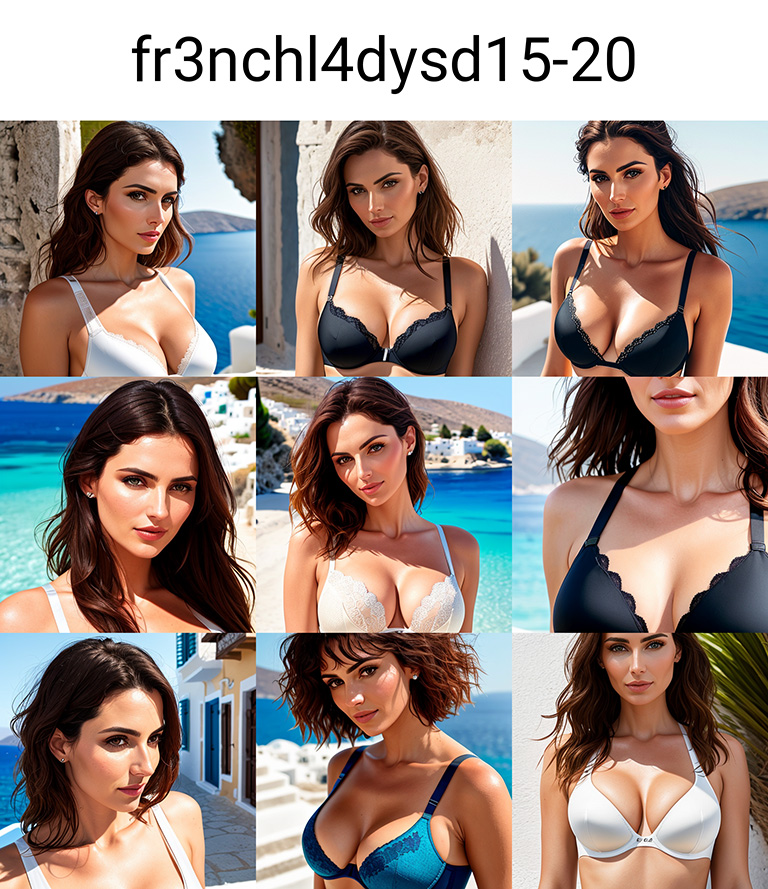

However, if we look a little further ahead, we can see that things really start to turn into our character somewhere between step 80 and step 120. Here are the outputs of those steps from SD 1.5:

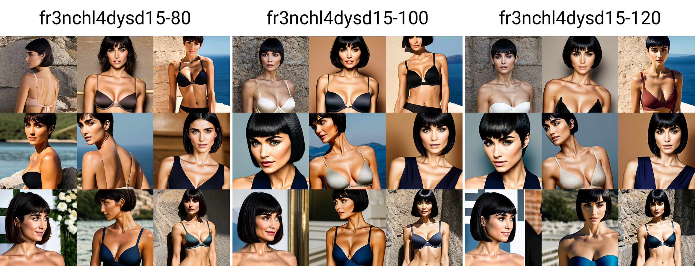

…and from Deliberate v2:

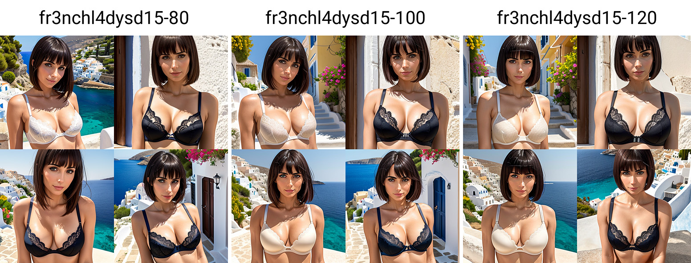

To narrow things down further, we'll generate a second comparison image, this time using the embeddings we generated every five iterations between 80 and 120 steps.

Change the `X values` box to the following, and generate another grid for the two checkpoints (replacing `fr3nchl4dysd15-20` with `fr3nchl4dysd15-80` in the prompt as the new starting value):

```
fr3nchl4dysd15-80, fr3nchl4dysd15-85, fr3nchl4dysd15-90, fr3nchl4dysd15-95, fr3nchl4dysd15-100, fr3nchl4dysd15-105, fr3nchl4dysd15-110, fr3nchl4dysd15-115, fr3nchl4dysd15-120
```

You're looking for the first iteration where all four of the images are definitely recognizably your character. For me, this turned out to be step 115.

## Validating the candidate embedding

We have now identified a candidate embedding. To validate it further, turn off the X/Y/Z plot script, and try generating batches of four images (each using the same starting seed) for the same prompt as above, using your candidate iteration (`fr3nchl4dysd15-115`, in my case) with a variety of different checkpoints from CivitAI. The goal here is to check that the iteration you selected adapts well to multiple different SD checkpoints.

I deliberately generate these images with a non-standard size of 512x768, to see how well the embedding adapts.

Here's the output with iteration 115 for a bunch of different photorealistic checkpoints.

[Avalon TRUvision](https://civitai.com/models/13020/avalon-truvision):

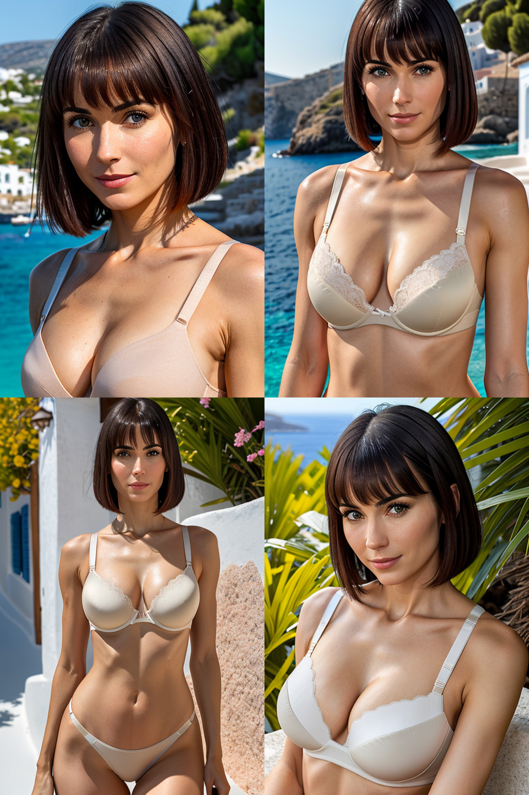

[Deliberate v2](https://civitai.com/models/4823/deliberate):

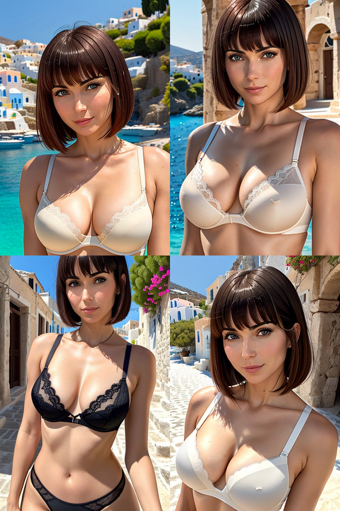

[GalaxyTimeMachine's "ForYou-Photo"](https://civitai.com/models/25636/galaxytimemachines-foryou-photo-fantasyai):

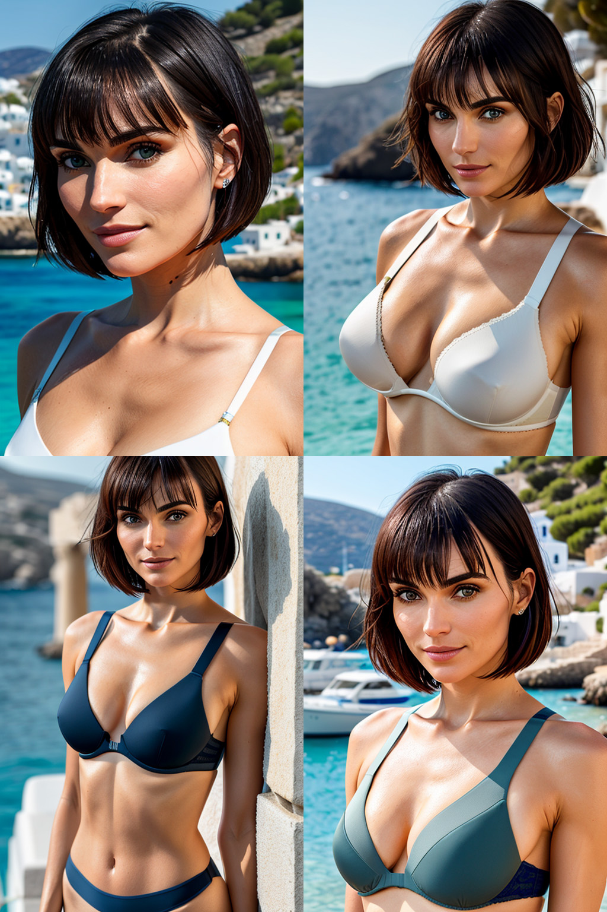

[Realistic Vision v2.0](https://civitai.com/models/4201/realistic-vision-v20):

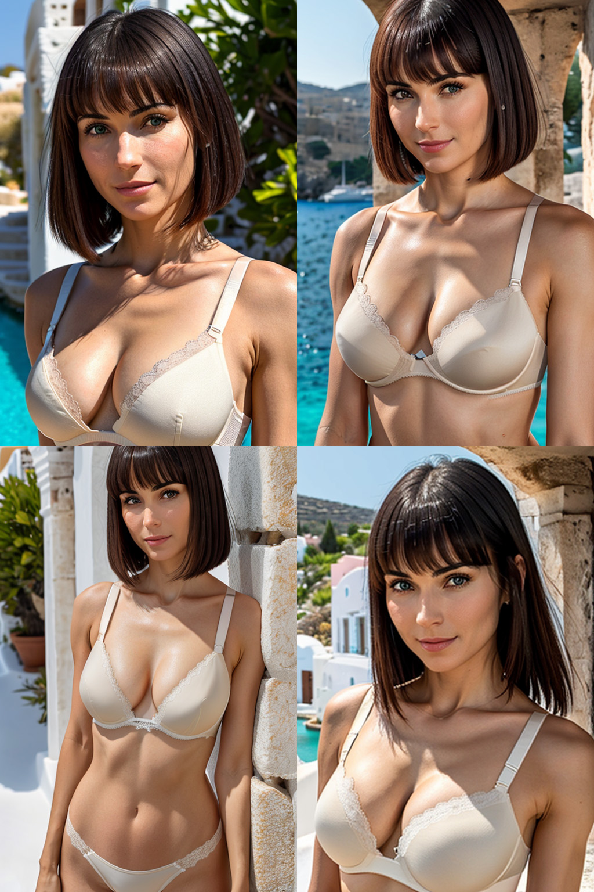

The results look good and pretty consistent for each checkpoint, which suggests that my choice of learning steps was the right one to pick.

## Using your Embedding

Now that you've selected the ideal embedding iteration, you can rename it to just `fr3nchl4dysd15.pt` (rather than `fr3nchl4dysd15-115.pt`), and use it in your own prompts. If you'd like to download the result I used above, [here it is](fr3nchl4dysd15.pt). Just drop that file in A1111's `embeddings` folder, and refresh the embeddings list to use it.

# Questions? Comments? Feedback?

I hope you've enjoyed this tutorial! If you have any questions, comments, feedback, or just want to say thank you, head over to the [tutorial discussion](https://github.com/BelieveDiffusion/tutorials/discussions/3) - I'd love to hear what you think.

You can also find and follow me on [Twitter](https://twitter.com/BelieveDiffuse), [Reddit](https://www.reddit.com/user/BelieveDiffusion), [Instagram](https://www.instagram.com/believediffusion/), and [CivitAI](https://civitai.com/user/BelieveDiffusion).