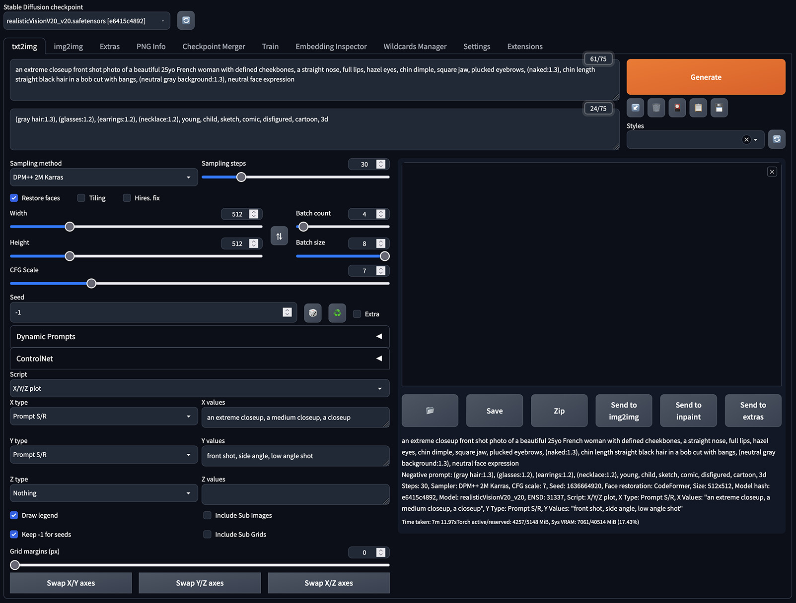

# Creating a Consistent Character as a Textual Inversion Embedding with Stable Diffusion

One of the great things about generating images with Stable Diffusion ("SD") is the sheer variety and flexibility of images it can output. However, some times it can be useful to get a _consistent_ output, where multiple images contain the "same person" in a variety of permutations.

To that end, I've spent some time working on a technique for training Standard Diffusion to generate consistent "made-up" characters whose faces, bodies, and hair look essentially the same whenever you use them in a prompt. This tutorial is a description of the approach I use.

You can see [all of the "LastName" characters I've trained with this method on CivitAI](https://civitai.com/user/BelieveDiffusion). And credit where it's due - they were inspired by the [Nobody series by Zovya](https://civitai.com/tag/znobody). Thank you for the inspiration, Zovya!

## Goals

If all goes to plan, by the end of this tutorial you will have created a Standard Diffusion [Textual Inversion embedding](https://arxiv.org/abs/2208.01618) that can reliably recreate your character across multiple poses, SD checkpoints, hair styles, body types, and prompts.

## Process

The creation process is split into five steps:

1. Generating input images
2. Filtering input images
3. Tagging input images
4. Training an embedding on the input images
5. Choosing and validating a particular iteration of the trained embedding

# 1. Generating input images

Training an AI is a classic example of the "garbage in, garbage out" principle. The better the input images you provide, the better the output you'll get. To that end, I use SD to generate the input images for the character I'm going to train. That way, I can generate hundreds of permutations based on a description of that character, and pick just the best images to use for the later training.

I generate these images via [Automatic1111's Stable Diffusion web UI](https://github.com/AUTOMATIC1111/stable-diffusion-webui) (I'll call it "A1111" below). I won't cover how to set up A1111 here; there are lots of tutorials available for getting A1111 up and running. But here's how I customize A1111 for input image generation.

## Choosing a checkpoint for generating your input images

You can use any SD checkpoint you like to generate your input images, although it's essential that the model you choose has seen (and can generate) representative examples like your character. I've been creating photorealistic made-up characters, and I've found [Deliberate](https://civitai.com/models/4823/deliberate) (v2) to be a good, flexible checkpoint for that, but there are plenty of other models available on sites like [CivitAI](https://civitai.com/).

## Turning on the inclusion of tags in the output

We're going to define an input prompt for generating our input images, which we'll convert into a training prompt later on. To make that conversion process as easy as possible later, turn on "Create a text file next to every image with generation parameters" in A1111's "Settings > Saving images/grids" settings, and then click "Apply settings". This will write out a `.txt` file next to every generated `.png` input image, containing the full input prompt for that image.

## Setting up an input prompt

With your preferred generation checkpoint selected in A1111's web interface, open the `txt2img` tab, and enter a positive prompt with the following format:

```
an extreme closeup front shot photo of %your character's look% (naked:1.3), %your character's body shape%, %your character's hairstyle%, (neutral gray background:1.3), neutral face expression
```

For this input prompt, I've boosted the strength of the `naked` prompt token, to say "we _really_ want the images to be of the character naked, please." I've found this reduces the number of non-naked images we have to throw away later on. Similarly, I've boosted "neutral gray background", so that (hopefully) all of the images come out with nothing distracting in the background.

Replace `%your character's look%`, `%your character's body shape%`, and `%your character's hairstyle%` in the prompt with descriptions that will reliably generate a face, body, and hairstyle that match your target character.

Be descriptive, but try to stay within the `75/75` limit of A1111's input prompt box. The fewer essential details you provide, the more chance there is that those details will be present in every image you generate. And the facial details are really the ones that matter.

One tip I've learned from experience: adding a country of origin can really help to hone in on an overall base look, which you can then refine with more details. (A country of origin may also guide your character's overall skin tone, too.)

Here's an example of just-enough-but-not-too-much detail:

```
an extreme closeup front shot photo of a beautiful 25yo French woman with defined cheekbones, a straight nose, full lips, hazel eyes, chin dimple, square jaw, plucked eyebrows, (naked:1.3), small breasts, toned body, chin length straight black hair in a bob cut with bangs, (neutral gray background:1.3), neutral face expression
```

For the negative prompt, try something like this:

```
(gray hair:1.3), (glasses:1.2), (earrings:1.2), (necklace:1.2), (high heels:1.2), young, loli, teen, child, (deformed, distorted, disfigured:1.3), poorly drawn, bad anatomy, wrong anatomy, extra limb, missing limb, floating limbs, (mutated hands and fingers:1.4), disconnected limbs, mutation, mutated, ugly, disgusting, blurry, amputation, tattoo
```

Note that I've added `(gray hair:1.3)` to the negative prompt there. Boosting `neutral gray background` in the positive prompt has a tendency to cast a gray color over anything else with a specified colored in the prompt, so we need to counterbalance that for the black-colored hair to make sure we get the color we want. (This is a good trick whenever two colors in a prompt start to influence each other in a way you don't want.)

Next, set the following `txt2img` settings in A1111:

- Sampling method: DPM++ 2M Karras
- Sampling steps: 30
- Restore Faces: On
- Width: 512
- Height: 512
- CFG Scale: 7
- Seed: -1

These settings should give good-quality outputs, at the expense of slightly longer generation times. (But remember: garbage in, garbage out.)

### Why naked and neutral?

I like to make input images that are as "neutral" as possible, so that SD learns the essence of them without also learning things that we might want to change for variety in image generation prompts. So, I try to avoid generating images that contain things like glasses, earrings, necklaces, and so on, that might bias later generation to include those same items.

I also choose to generate the training input images without clothes, because I want to train the base concept of a hypothetical human that I can then add any clothing or accessories to via custom prompts later on. SD has seen a lot of humans wearing a lot of different clothes, but it has never seen your custom character naked, so that's what we'll give it as input, for the most flexibility.

I also use a neutral gray background in all my input images, to keep the training focused on the character on the foreground. (We'll tell SD that we used a neutral gray background later on, so that it doesn't learn "neutral gray background" as part of the character's attributes.)

## Testing the input prompt

With the settings above in place, generate a small set of test images to see how well your prompt performs. I usually set `Batch count` to 2 and `Batch size` to 4 (with a `Seed` of `-1`), then hit Generate, to create eight test images. This helps me to see if the prompt creates a consistent (enough) output across multiple seeds.

Note that even with a detailed description like the one above, your character might not (yet) look entirely consistent between all of the images. That's okay - we will improve that by filtering the images later, and also by averaging the character's visual characteristics through training. But you still want to be seeing a recognizable-enough consistency at this stage. If you don't, tweak your prompt, and try again.

## Generating permutations

The next thing we want to do is to generate a whole bunch of variations of our character, with different viewing angles and camera zooms. I mentioned above that SD follows the principle of "garbage in, garbage out"; the same also holds for "variation in, variation out". In other words, the more of a variety of angles and framings we can show SD of our character, the better SD will become at generating varied angles and framings when we use our character in prompts later on.

To add this variety, open the `Script` menu, and select `X/Y/Z Plot`. Set `X type` and `Y type` to `Prompt S/R` ("Prompt search and replace"), and keep `Z type` as `Nothing`.

In the `X values` text box, paste the following five zoom levels:

```
an extreme closeup, a medium closeup, a closeup, a medium shot, a full body
```

This tells the A1111 web UI that we want to generate images with five different permutations of our prompt - one that uses the original `an extreme closeup` text from the main prompt box, and four others that replace that text in the prompt with an alternative zoom level. This will give us images of our character from a variety of distances.

In the `Y values` text box, paste the following five viewing angles:

```
front shot, rear angle, side angle, shot from above, low angle shot
```

This tells the A1111 web UI that we want to generate images with five more permutations of our prompt - one that uses the original `front shot` viewing angle, and four others that replace that text with an alternative angle for viewing the character.

Because we have _two_ `Prompt S/R` options set for the script, with five variations in each, we've actually told A1111 to generate 25 permutations of our prompt - one for each combination of framing and viewing angle. This will give us lots of varieties of views of our character to choose from for training.

(Note: I borrowed these zoom levels and viewing angles from the [Unstable Diffusion tagging white paper](https://docs.google.com/document/d/1-DDIHVbsYfynTp_rsKLu4b2tSQgxtO5F6pNsNla12k0/edit).)

Finally, check the box next to `Keep -1 for seeds`, and set `Batch Count` and `Batch Size` both to 4. This will generate 16 images for every permutation of the above, in batches of four for speed. (If your GPU can handle it, you can use a `Batch Count` of 2 and a `Batch Size` of 8 instead.)

Here's how that looks for me with today's A1111 interface:



With all of the above, we have asked A1111 to generate 400 images (16 x 5 x 5). Hit the `Generate` button, and leave A1111 to do its thing. Maybe make a hot beverage. Step 1 is complete!

Here's a reduced version of the entire output of this initial step when I ran it:


# 2. Filtering input images

You now have 400 _possibly_ good images that _possibly_ look like the character you're trying to create. If you want to skip the generation step above, here's a zip file of the 400 images I generated while writing this tutorial, together with their text files.

The next step is to filter these 400 images down to ~150 _definitely_ good images to train with. Here's how I do that.

## Remove any images that are obviously off-prompt

Here, I'd remove images where the character is clothed, or wearing jewelry, or has a non-matching hairstyle, or has their face off-screen, or the background isn't gray, or the arms / legs are funky, or there are multiple people, or… basically, anything that isn't what we asked for.

Here's an example of some of the images I removed from my set of 400 at this step in the process. Note that I removed any images where the hairstyle did not have the requested bangs (fringe), to ensure consistency in the input images later on. This first pass removed 45 images. (Check the image alt tags for the reasons why I removed them.)


## Remove poor quality images

This time, we're removing images that have wonky faces, or weird-looking nipples, or eyes that Restore Faces kinda messed up, or… images are just not a great photo of a person.

Here's an example of some of the images I removed at this stage (66 in total).


## Remove images that don't "look like the character"

This might seem like a weird thing to say. This person doesn't exist! How do we know what they look like?

Well: that's for you to define. There will usually be an overall "look" to the character already by this point, and some of the images won't match that look nearly as well as the others. So, filter those images out, and narrow in on the look of the specific person you're trying to create.

For reference, I cut another 119 images in this step. This was partly because I decided to enforce a slightly more consistent hair length for the bob, and partly from honing in on the look of the character. Here are some examples. (And I should stress that this is _not_ an exact science.)
	


## Fine-tune to just the best images

This is really just a more selective take on the second and third steps above, to narrow in to the best of the best images in the input set. I culled another 20 images at this step to get me to my final 150.

Ideally, after doing all of the above, you will have 150(ish) good-quality images left that look like the character you're aiming for. If you don't, just generate another batch, and repeat the process. Even more ideally, the final set of images will contain a good representation of the five zoom levels and viewing angles too.

# 3. Tagging input images

In theory, you can just pass all of your input images to the trainer without any tags, and get a textual inversion embedding out the other side. However, the embedding will be _way_ more flexible as if you spend some time tagging the images first. The good news is, the tags from the generation process above are already halfway to what you need.

## Naming your character

The first and most important thing to include in the tagging is the name of the character (and embedding) itself, i.e. the new thing we want SD to learn. Now is a good time to choose a name for your embedding.

You're looking for a single word (more precisely, a _token_) to name the embedding. This token should be a series of letters and numbers without spaces, which is very unlikely to have shown up on the Internet in the images that SD was trained on. As an example, for my [Antonia LastName character](https://civitai.com/models/19725/antonia-lastname), I chose `antonialastnamesd15`. But the embedding name can be anything, as long as it's not a token that already has a meaning.

If you're not sure your choice of embedding name / token is unique enough, just try sticking it in a `txt2img` prompt all by itself, and generating a few images with the base SD1.5 checkpoint to see what SD thinks that token already means.

For the purposes of this tutorial, let's call the character `fr3nchl4dysd15`. To add that name to your tags, in the text file for each generated image, replace:

```
a beautiful 25yo French woman with defined cheekbones, a straight nose, full lips, hazel eyes, chin dimple, square jaw, plucked eyebrows
```

…with…

```
fr3nchl4dysd15
```

…giving (for example):

```
an extreme closeup front shot photo of fr3nchl4dysd15 (naked:1.3), small breasts, toned body, chin length straight black hair in a bob cut with bangs, neutral gray background, neutral face expression
```

Essentially, the thing we want SD to learn - our character - is the sum total of all of those attributes combined. So, we replace those attributes from the input prompt with the character's embedding name, to form the basis of our training prompt. (It's kind of like saying "a photo of Marilyn Monroe", but instead of using the name "Marilyn Monroe", we're using the made-up name "`fr3nchl4dysd15`".)

## Tidying up the input prompts

One of the goals of tagging is to tell the training process about all of the things that are _not_ the essence of your character in each image. For example: we generated training images above that had a neutral gray background, but we don't always want our character to appear in images with neutral gray backgrounds. So, we want to tag each image with "neutral gray background" when it goes into the trainer, so that the trainer knows that "neutral gray background" is not an attribute of our character.

The good news is, we already have a lot of this detail captured in our existing text files from step 1 above. To tidy up those existing prompts, we can change `(naked:1.3)` in all of the text files to just `naked`, and change `(neutral gray background:1.3)` to just `neutral gray background`. (We don't need to boost these terms in the training tags - we're just stating facts about the generated images).

Our training prompt for an example image is now something like:

```
an extreme closeup front shot photo of fr3nchl4dysd15 naked, small breasts, toned body, chin length straight black hair in a bob cut with bangs, neutral gray background, neutral face expression
```

This is (IMHO) a pretty good training prompt… with one exception. We may have _asked_ SD to generate `an extreme closeup front shot photo` for some image in our initial set of 400 images, but that's no guarantee that SD actually gave us what we asked for. So, now for the boring bit: going through each filtered image and checking that the zoom level and viewing angle in the tags actually match the image.

In many cases, they _will_ match, and you can leave the tags alone; but if they don't match, just edit them until they do. For example, `an extreme closeup front shot photo` might become `a medium closeup side angle photo` if the character isn't that close to the camera, and is turned more to the side.

### Tidying up the zooms

There's no exact science to what these zoom definitions mean. I found [the framing image from this article](https://www.studiobinder.com/blog/cowboy-shot-examples-types-of-shots-in-film/) to be a very useful guide. Here's how I apply the zooms, working from widest angle to closest:

1. Can you see the knees? If so, it's probably `"a full body"` photo.
2. Can you see the waist? If so, it's probably `"a medium shot"` photo.
3. Can you see the breast area? If so, it's probably `"a closeup"` photo.
4. Can you see the neck area? If so, it's probably `"a medium closeup"` photo.
5. If none of the above, it's probably `"an extreme closeup"` photo.

### Tidying up the viewing angles

This is also not an exact science. Here's how I define it (but who knows if I'm right), again from top to bottom:

1. Can you see any of the character's back (at all)? If so, it's a `"rear angle"` photo.
2. Are the character's shoulders turned at an angle (like, more that 15°) from the camera? If so, it's a `"side angle"` photo.
3. Did you request a `"shot from above"` angle, and the character looks like they are lying on their back, or sitting / kneeling and looking up at the camera? If so, it's a `"shot from above"` photo.
4. Is the camera obviously looking up at the character from below their chest area? If so, it's a `"low angle shot"` photo.
5. If none of the above, it's a `"front shot"` photo (which will probably be the majority of your images).

## Adding posture information

For my LastName characters, I've also chosen to include posture information in the training tags. This is a time-consuming pain to add to 150 images, but (I assume?) makes things more flexible. I don't have any science to back that up, so feel free to skip this section if you don't want to do even more tagging.

For the input image generation process above, I usually choose between this subset of the postures from the [Unstable Diffusion tagging white paper](https://docs.google.com/document/d/1-DDIHVbsYfynTp_rsKLu4b2tSQgxtO5F6pNsNla12k0/edit) when tagging my images:

- `standing`
- `lying on her back`
- `lying on her front`
- `lying on her side`
- `bent over`
- `on all fours`
- `kneeling`

# 4. Training an embedding on the input images

[When you create the embedding in the A1111 web interface, you have the option to provide a… I forget what it is, but it's "*" by default. I change that to "woman".]

[As I understand it, that's saying "the new thing you are about to learn - antonialastnamesd15 - should be learned from a starting point of what you already understand as 'woman'".]

[Oh… and I also ended up with antonialastnamesd15 in my prompt twice, because I couldn't get it to work with just filewords, so I used name filewords]

[If she is wearing clothes that you don't want to be part of what you train into the AI, you should also include the clothes in your prompt. You can also crop out the clothing so you'll have images with no clothing in them, even if you don't have naked images.]

[The initialization text is the starting point for your TI, so you could put a more extensive prompt there (hair and eye color, for instance), to give it a good start. Well, if it isn't a feature of what you are trying to train, I wouldn't include it. But, if you want all your output images to have black hair, because that is how your subject is, I would put it in.]

# 5. Choosing and validating a particular iteration of the trained embedding

[FIXME]